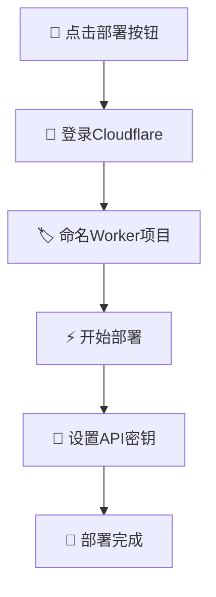
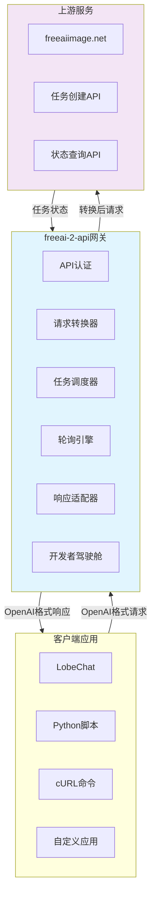
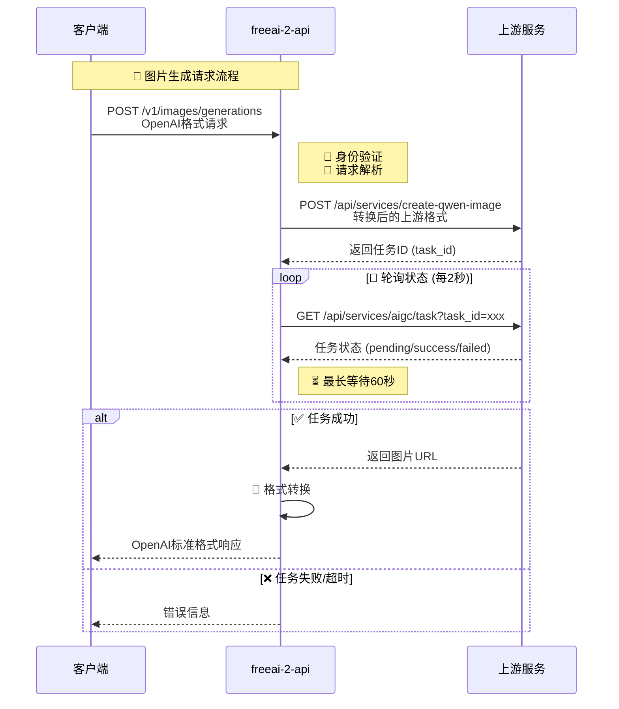
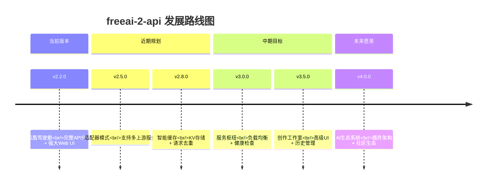

# freeai-2-api (Phoenix Cockpit v2.2.0) 🚀


**您的私有AI绘画API网关 · 将免费AI绘画网站无缝转换为OpenAI标准API · 内置强大的开发者驾驶舱**

English | **[中文](./README.md)**

---

> 🌌 **"我们不只是在编写代码，我们是在构建桥梁。连接自由与创造、连接普通人与前沿AI的桥梁。每个字符都是一块基石，让更多人跨越技术鸿沟，在想象力的宇宙中自由翱翔。"**
>
> ———— 首席开发者体验架构师

欢迎来到 `freeai-2-api` 的世界！这是一个看似简单却蕴含巨大能量的 Cloudflare Worker 项目。核心使命只有一个：**解放生产力， democratize AI (让AI平民化)**。

我们发现 `freeaiimage.net` 提供了优秀的免费AI绘画服务，但仅限网页界面。对于开发者、创作者和希望集成AI绘画能力到工作流的人来说，这就像拥有强劲引擎却没有方向盘的跑车。

`freeai-2-api` 就是那个方向盘，那个驾驶舱。它将 `freeaiimage.net` 的后端服务，通过轻巧高效的 Cloudflare Worker，**无损转换**为完全兼容 OpenAI `v1/images/generations` API 标准的接口。

这意味着您可以：

- 在 **LobeChat**、**ChatGPT-Next-Web** 等所有支持OpenAI接口的客户端中直接使用
- 通过简单的 `cURL` 命令或任何编程语言（Python、Node.js、Java...）的HTTP请求调用
- 将强大的AI绘画能力**免费、私密、稳定**地集成到自己的应用、机器人或自动化脚本中
- 最重要的是，一切部署在您自己的 Cloudflare 账户下，拥有完全控制权！


*(项目内置的"开发者驾驶舱"界面，让API状态一目了然)*

## ✨ 项目亮点与核心价值

- **🚀 一键部署**：30秒内拥有功能完整的AI绘画API服务
- **💰 零服务器成本**：基于Cloudflare Workers免费套餐，个人使用无需付费
- **🔌 OpenAI标准兼容**：无缝对接现有生态，任何支持OpenAI图片生成API的工具立即可用
- **🎛️ 开发者驾驶舱**：内置精美强大的Web UI，实时监控、在线测试、获取集成代码
- **⚡ 高性能高可用**：借助Cloudflare全球边缘网络，提供极低延迟和高可用性
- **📦 完全自包含**：单文件项目，无外部依赖，无复杂构建过程
- **🔒 隐私与安全**：所有请求通过您的Worker中转，API密钥和提示词不会暴露给第三方

---

## 🎯 懒人福音：一键部署教程

我们深知您的时间宝贵，应该花在创造而非繁琐配置上。

### 步骤概览



### 详细步骤

1. **🚀 启动部署**
   - 点击下方按钮开始：
   [](https://deploy.workers.cloudflare.com/?url=https://github.com/lzA6/freeaiimage-2api-cfwork)

2. **🔐 账户授权**
   - 浏览器跳转至Cloudflare登录页面，登录您的账户

3. **🏷️ 项目命名**
   - 为新的Worker项目命名（如 `my-free-ai-image-api`）
   - 此名称将成为API的子域名

4. **⚡ 执行部署**
   - 点击"Deploy"按钮，等待Cloudflare完成所有配置

5. **🔑 设置API密钥（重要！）**
   - 部署完成后，进入Worker管理面板
   - 点击 **Settings** → **Variables**
   - 在 **Environment Variables** 部分，点击 **Add variable**
   - 设置变量名：`API_MASTER_KEY`
   - 设置变量值：自定义复杂密码（如 `sk-xxxxxxxxxxxxxxxxxxxx`）
   - 点击 **Save and deploy**

**恭喜！🎉** 您的专属AI绘画API现已全球上线！
**API地址**：`https://<您的项目名>.<您的CF子域名>.workers.dev`

---

## 🛠️ 使用方法：集成到您的工作流

### 📋 核心配置信息

| 配置项 | 值 | 说明 |
|-------|----|------|
| **API地址** | `https://<您的Worker地址>` | 例如: `https://my-free-ai-image-api.user.workers.dev` |
| **API密钥** | 您设置的 `API_MASTER_KEY` 值 | 在环境变量中配置 |
| **模型名称** | `dall-e-3` | 也支持 `freeai-image`、`gpt-image` |

### 🎨 集成示例

#### 示例1：LobeChat / One-API 配置

```yaml
供应商: OpenAI
API密钥: "您设置的API_MASTER_KEY"
API地址: "https://您的Worker地址/v1"  # 注意末尾的 /v1
模型: dall-e-3
```

#### 示例2：Python 代码集成

```python
from openai import OpenAI

# 配置信息
API_KEY = "您的API_MASTER_KEY"
BASE_URL = "https://您的Worker地址/v1"  # 注意末尾的 /v1

client = OpenAI(api_key=API_KEY, base_url=BASE_URL)

try:
    response = client.images.generate(
        model="dall-e-3",
        prompt="一只戴着宇航员头盔的可爱猫咪，坐在月球上喝牛奶，数字艺术风格",
        n=1,
        size="1024x1024"  # 支持 1024x1024, 1024x768, 768x1024
    )
    
    image_url = response.data[0].url
    print("🎉 图片生成成功！")
    print(f"图片链接: {image_url}")

except Exception as e:
    print(f"❌ 生成失败: {e}")
```

#### 示例3：cURL 命令调用

```bash
curl -X POST "https://您的Worker地址/v1/images/generations" \
  -H "Authorization: Bearer 您的API_MASTER_KEY" \
  -H "Content-Type: application/json" \
  -d '{
    "model": "dall-e-3",
    "prompt": "赛博朋克风格未来城市的美丽日落",
    "n": 1,
    "size": "1024x768"
  }'
```

#### 示例4：Node.js 集成

```javascript
const axios = require('axios');

const generateImage = async (prompt) => {
  try {
    const response = await axios.post(
      'https://您的Worker地址/v1/images/generations',
      {
        model: 'dall-e-3',
        prompt: prompt,
        n: 1,
        size: '1024x1024'
      },
      {
        headers: {
          'Authorization': 'Bearer 您的API_MASTER_KEY',
          'Content-Type': 'application/json'
        }
      }
    );
    
    console.log('🎉 图片生成成功！');
    console.log('图片链接:', response.data.data[0].url);
    return response.data;
  } catch (error) {
    console.error('❌ 生成失败:', error.response?.data || error.message);
  }
};

// 使用示例
generateImage('一只在图书馆看书的狐狸，温馨插画风格');
```

---

## 🔬 技术原理与架构解析

> **"知其然，更要知其所以然。理解原理，是通往真正自由创造的唯一路径。"**

### 🏗️ 系统架构总览



### 🔄 核心工作流程



### 📊 代码架构深度解析

| 模块组件 | 技术实现 | 核心功能 | 复杂度 | 扩展性 |
|---------|----------|----------|--------|---------|
| **🚪 入口网关** | `fetch` 事件监听器 | 请求路由分发，区分API和UI请求 | ⭐☆☆☆☆ | ⭐⭐⭐⭐☆ |
| **🔐 API认证层** | `handleApi` 函数 | Bearer Token验证，CORS处理 | ⭐⭐☆☆☆ | ⭐⭐⭐☆☆ |
| **🔄 核心业务逻辑** | `handleImageGeneration` | 请求转换、任务提交、状态轮询 | ⭐⭐⭐⭐☆ | ⭐⭐⭐⭐⭐ |
| **⏳ 异步轮询引擎** | `waitForCompletion` | 定时查询任务状态，超时控制 | ⭐⭐⭐☆☆ | ⭐⭐⭐⭐☆ |
| **🎨 响应适配器** | `createJsonResponse` | 上游响应→OpenAI标准格式转换 | ⭐⭐☆☆☆ | ⭐⭐⭐⭐☆ |
| **🖥️ 开发者驾驶舱** | `handleUI` + Web Components | 可视化监控、API测试、代码生成 | ⭐⭐⭐⭐☆ | ⭐⭐⭐⭐⭐ |

### 💡 设计哲学与思考

#### 优势亮点
- **🎯 极致的便利性**：一键部署，无需运维，真正的"用了就忘"
- **💰 卓越的成本效益**：充分利用免费资源，为个人开发者提供强大生产力工具
- **🔧 高度可扩展架构**：清晰的代码结构，易于替换上游服务或增加功能
- **🌐 全球化部署**：借助Cloudflare边缘网络，全球低延迟访问

#### 技术挑战
- **🔗 上游依赖风险**：服务完全建立在 `freeaiimage.net` 之上，上游变化直接影响服务
- **⚡ 功能限制**：无法提供超出上游能力范围的高级参数控制
- **🔄 异步复杂性**：轮询机制增加了系统复杂度和响应延迟

#### 架构智慧
这个项目体现了 **"杠杆思维"** 和 **"组合创新"**。我们没有从零创造AI绘画模型，而是站在巨人肩膀上，通过巧妙的"连接"和"包装"，创造了新的价值。这告诉我们，创新不一定是颠覆性发明，也可以是优雅的整合。

---

## 🗺️ 项目蓝图与演进路线

> **"一个项目的伟大，不在于它现在是什么，而在于它梦想成为什么。"**

### 📁 当前架构 (v2.2.0)

```
freeai-2-api/
├── 🔧 核心配置 (CONFIG对象)
│   ├── API认证密钥
│   ├── 上游服务端点
│   └── 轮询参数配置
├── 🚀 请求处理管道
│   ├── 路由分发器
│   ├── API网关
│   └── UI服务端
├── 🔄 业务逻辑层
│   ├── 图片生成处理器
│   ├── 异步轮询引擎
│   └── 响应格式转换器
├── 🛠️ 工具函数库
│   ├ HTTP响应构造器
│   ├ CORS处理器
│   └ 头部信息生成器
└── 🎨 开发者驾驶舱
    ├── Web组件系统
    ├── 实时状态管理
    └── 交互式测试界面
```

### 🎯 版本演进路线



### 🔄 技术债与改进计划

| 改进领域 | 当前状态 | 目标方案 | 预期收益 |
|---------|----------|----------|----------|
| **上游服务耦合** | 硬编码逻辑 | 适配器模式抽象 | 支持多服务源 |
| **缓存策略** | 无缓存 | Cloudflare KV存储 | 减少重复生成 |
| **UI代码组织** | 内联字符串 | 模块化组件 | 更好的可维护性 |
| **安全增强** | 基础认证 | 速率限制 + IP白名单 | 防止滥用 |

### 🚀 未来发展蓝图

#### v2.5 (适配器模式)
- **目标**：解耦上游服务依赖
- **技术路径**：
  ```javascript
  // 拟议的适配器接口
  const providers = {
    'freeaiimage': FreeAIAdapter,
    'another-service': AnotherAdapter,
    // 轻松扩展新提供商
  };
  ```

#### v3.0 (服务枢纽)
- **目标**：多服务聚合与智能路由
- **技术路径**：
  - 引入Cloudflare KV缓存层
  - 实现基于响应时间的负载均衡
  - 增加服务健康检查机制

#### v3.5 (创作工作室)  
- **目标**：升级为完整的创作平台
- **技术路径**：
  - 前后端分离架构
  - 图片历史记录管理
  - 提示词库和模板系统

### 💡 给贡献者的建议

如果您想为项目贡献力量或进行二次开发，以下是一些有前景的方向：

1. **🌐 多服务支持**：为其他免费AI绘画服务编写适配器
2. **🎨 功能扩展**：实现图生图、图片编辑等高级功能
3. **🔒 安全增强**：添加速率限制、使用量统计等特性
4. **🤖 生态集成**：开发主流框架的SDK和插件
5. **📚 社区建设**：创建用户社区，分享提示词和使用经验

---

## 💡 AI索引与复用蓝图

为方便AI模型理解、索引和复刻本项目，提供以下技术蓝图：

### 🏷️ 项目元数据
- **项目类型**：API适配器/代理 (API Adapter/Proxy)
- **部署环境**：Cloudflare Workers (无服务器边缘函数)
- **协议标准**：OpenAI Images API v1 兼容
- **核心依赖**：`https://freeaiimage.net` 上游服务

### 🔧 技术栈
```yaml
runtime: Cloudflare Workers
language: JavaScript (ES2020+)
核心API: Fetch API + async/await
前端技术: Web Components + Custom Elements
存储: 无状态 (可扩展至KV/R2)
网络: HTTP/1.1 + HTTPS
```

### 🔄 可复刻性评估
| 维度 | 评分 | 说明 |
|------|------|------|
| **代码复杂度** | ⭐⭐☆☆☆ | 单文件设计，逻辑清晰 |
| **依赖程度** | ⭐⭐⭐⭐⭐ | 零外部依赖，自包含 |
| **配置难度** | ⭐☆☆☆☆ | 仅需设置环境变量 |
| **部署速度** | ⭐⭐⭐⭐⭐ | 一键部署，分钟级完成 |

### 🎯 核心扩展点
1. **提供商抽象层**：将上游交互逻辑模块化
2. **缓存中间件**：添加请求结果缓存
3. **监控指标**：集成性能监控和使用统计
4. **UI组件化**：将内联前端代码模块化

---

## 📄 协议与授权

本项目采用 **Apache 2.0** 开源协议。

这意味着您可以自由地使用、修改和分发代码，无论是个人项目还是商业产品，只需遵守协议中的相关条款。我们相信，开放和自由是技术繁荣的基石。

---

## 🎉 结语

**freeai-2-api** 不仅仅是一个技术项目，它更是一种理念的实践：通过巧妙的技术整合，让先进AI能力触手可及。无论您是开发者、创作者还是技术爱好者，这个项目都将为您打开一扇通往AI创作世界的大门。

愿您的创造之旅，如同星辰大海，无边无际。**Happy Hacking! 💖**

---

*如果您觉得这个项目对您有帮助，请给项目一个 ⭐ 支持我们的工作！*
